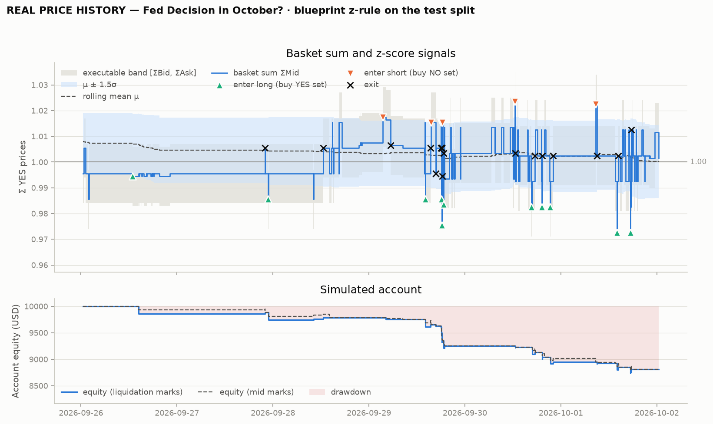
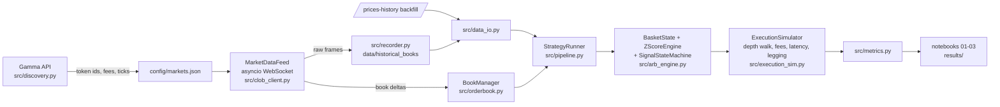

# Polymarket Statistical Arbitrage Platform

A research and simulation platform for **sum-to-one statistical arbitrage** on Polymarket's central limit order
book (CLOB). In a mutually exclusive outcome set (a Polymarket *negRisk* event, e.g. *"Fed decision in October?"*),
exactly one outcome resolves YES, so the fair prices of all YES contracts must sum to **$1.00**. Traded prices
don't. This project measures how and why they deviate, builds a streaming z-score engine on the basket sum, and
asks the question a quant desk would ask first: **does the signal survive real execution: spreads, taker fees,
order-book depth, latency and legging?**

Everything here runs on **real Polymarket data**:
- 30 days of 1-minute order-book midpoints from `/prices-history`
- live order books recorded from the CLOB WebSocket by this repo's own asyncio client

Synthetic data exists only as a clearly labelled offline fallback for tests.

**The short answer.** The z-signal is genuinely predictive:
- the basket sum mean-reverts while its legs follow random walks
- the cointegrating vector sits 5.8° from (1,…,1)
- on validation, mid-to-mid reversion trades win 100% of the time

But at taker prices that reversion is smaller than the cost of crossing the spread on every leg, twice. The blueprint rule
loses money. An execution-aware gate correctly refuses to trade, and no riskless basket arbitrage appeared in the
test window. Every number below is generated from `results/metrics.json`.

## Results

<!-- RESULTS:START -->
**Data: REAL Polymarket data** — 1-minute `/prices-history` mids (execution books modelled around them, calibrated on recorded live books) plus live WebSocket order books recorded by `src.recorder`.

**Basket:** `fed-oct-2026` · **test split:** 2026-09-26 09:02 → 2026-10-02 02:59 UTC (untouched until notebook 03) · **parameters** (walk-forward, 72 configs tried): N = 87 pushes, z_entry = 1.5, z_exit = 0.5

**Notebook 01 (30 days, 1-minute):** mean ΣP = 1.0105 (HAC t = 7.5), ADF p (Holm) = 4.8e-05 for the sum vs unit roots in the liquid legs, AR(1) half-life ≈ 117 min.

| strategy | trades | net P&L | return | Sharpe | max drawdown | gross mid-to-mid | spread | taker fees |
|---|---:|---:|---:|---:|---:|---:|---:|---:|
| A · blueprint z | 18 | −$1,188 | -11.9% | -8.54 | -12.6% | +$524 | −$554 | −$1,157 |
| B · gated z (edge > 0) | 0 | +$0 | +0.0% | n/a | +0.0% | +$0 | +$0 | +$0 |
| C · arbitrage only | 0 | +$0 | +0.0% | n/a | +0.0% | +$0 | +$0 | +$0 |
| A · blueprint z, convert on | 18 | −$1,071 | -10.7% | -8.37 | -11.5% | +$528 | −$520 | −$1,086 |
| B · gated z, convert on | 0 | +$0 | +0.0% | n/a | +0.0% | +$0 | +$0 | +$0 |



**Attribution of the blueprint rule (A):** gross mid-to-mid +$524, half spread −$554, taker fees −$1,157 → net −$1,188. Max drawdown -12.6% lasting 132 h (not recovered by the end of the sample); Sharpe -8.54 (1h returns, rf = 4.2%).
Without taker fees the same trades net −$28: the n-leg spread alone absorbs the reversion the signal captures.
**Recorded live books** (2.5 h so far): S_ask ≥ 1.013, S_bid ≤ 0.990, n-leg spread 0.023; pure-arbitrage trades found: 0.

_Generated by `python scripts/build_notebooks.py --update-readme` from `results/metrics.json`; data kinds: real_books, real_prices._
<!-- RESULTS:END -->

## The math

**Three sums, not one.** For YES best bids $b_i$, asks $a_i$ and mids $m_i$:

$$S_{mid}=\sum_i m_i,\qquad S_{bid}=\sum_i b_i,\qquad S_{ask}=\sum_i a_i,\qquad \text{no-arbitrage band: } S_{bid}\le 1\le S_{ask}.$$

The band is at least $n$ ticks wide. $S_{mid}$ is the statistical signal. You can trade only at $S_{bid}$ and $S_{ask}$.

**Long and short a basket.**

| trade | cost now | payoff at resolution | riskless edge (before fees) |
|---|---|---|---|
| buy 1 YES of every leg | $S_{ask}$ | exactly 1 | $1 - S_{ask}$ |
| buy 1 NO of every leg ("short the basket") | $\sum_i (1-b_i) = n - S_{bid}$ | exactly $n-1$ | $S_{bid} - 1$ |

Polymarket's YES and NO books are mirrored: a YES bid at $p$ is a NO ask at $1-p$. NegRisk *convert* turns a full NO
set into $n-1$ collateral immediately.

**Taker round trips.** With taker execution, P&L is:
- **short (NO set):** $S_{bid}^{entry} - \min(1, S_{ask}^{exit}) - \text{fees}$ with convert, or $S_{bid}^{entry}-S_{ask}^{exit}-\text{fees}$ without it;
- **long (YES set):** $\max(S_{bid}^{exit}, PV(1)) - S_{ask}^{entry} - \text{fees}$.

So **reversion of $S_{mid}$ inside the band cannot be monetised by taker orders.** The z-score decides *when* to look; the executable
edge decides *whether* to trade.

**Fees.** The Polymarket taker fee is $C\cdot r\cdot\big(p(1-p)\big)^{e}$:
- $e=1$; makers pay nothing.
- The rate $r$ comes from each market's `feeSchedule` (0.05 for the Fed market, 0.04 politics, 0.07 crypto).
- On buys the fee is collected in shares.
- For a whole basket, $F=\sum_i r_i p_i(1-p_i)\approx r\,(1-\sum_i p_i^2)$.
- A z round trip must clear the hurdle $\sum_i s_i + 2F$.
- The **edge-to-cost ratio** $ECR=\sigma(S)/\text{hurdle}$ ranks baskets (pro-tip 2).

**Streaming z-score** (`src/arb_engine.py`):

$$z_t=\frac{S_t-\mu_{t-1}}{\max(\sigma_{t-1},\sigma_{floor})}$$

- $\mu$ and $\sigma$ come from the last $N$ *changes* of $S$, held in a NumPy ring buffer. Updates are O(1) via sliding-window Welford, with an exact two-pass recompute every $N$ pushes to bound float drift.
- $S_t$ is excluded from its own window. Otherwise a jump would inflate $\sigma$ and damp its own z.
- $\sigma_{floor}$ is half a tick.
- A vectorised batch version is tested equal to the streaming engine to 1e-9, and a prefix-invariance test proves there is no look-ahead.

**Signals.**
- Enter **short** (buy the NO set) when $z>z_{entry}$, and **long** (buy the YES set) when $z<-z_{entry}$.
- Exit when $|z|<z_{exit}$. $z_{exit}=0$ means a zero crossing.
- Optional stop, timeout and cooldown.
- A gate callback filters entries on the exact exit-formula edge.

**Statistics** (`src/stats_tools.py`):
- ADF and KPSS with Holm correction
- Lo–MacKinlay variance ratios and variograms
- AR(1)/Ornstein–Uhlenbeck half-life with delta-method and block-bootstrap intervals
- Newey–West tests of $E[S]=1$
- Engle–Granger and Johansen (angle of the cointegrating vector to ι)
- rolling OLS with lagged parameters
- walk-forward window selection with an embargo and plateau (not argmax) selection

**Performance** (`src/metrics.py`):
- Sharpe on regularly sampled returns of *liquidation-marked* equity, excess over a risk-free rate, annualised for 24/7 markets
- Sortino
- max drawdown depth and duration, flagging unrecovered drawdowns as censored
- Wilson hit-rate intervals
- stationary-bootstrap confidence intervals
- an "anecdotal" flag under 30 trades

## Pipeline



**The live client** (`src/clob_client.py`):
- It subscribes to the market channel and sends a text `PING` every 10 s. A connection with no `PONG` for 30 s counts as stale.
- It reconnects with full-jitter backoff. On every reconnect it resubscribes and resyncs books over REST. Resyncs are tagged with the connection number, so a late snapshot from a dead connection can never overwrite fresher data.
- It parses both `price_change` schemas.
- It never blocks its reader:
  - the strategy reads from a per-asset *coalescing* queue;
  - the recorder reads from a lossless queue bounded by items and bytes, which writes an explicit gap marker and forces a resync on overflow;
  - the reader yields to the event loop every 50 frames, so a burst cannot starve the heartbeat.
- The hot path (`orderbook`, `clob_client`, `arb_engine`, `execution_sim`) never imports pandas. A test enforces this.

## Repository layout

```
config/markets.json            baskets (legs discovered from Gamma), pairings, simulation defaults
data/historical_books/         live WebSocket recordings: manifest + exported top-of-book (raw files gitignored)
data/prices_history/           real /prices-history backfills (1-minute last 30 days, hourly since creation)
notebooks/01_sum_to_one_eda.ipynb      Phase 2: is the sum structurally mean-reverting?
notebooks/02_cross_market_ols.ipynb    Johansen, cross-event identities, walk-forward window selection
notebooks/03_view_results.ipynb        Phase 5: backtest, metrics, attribution (the blueprint's "02_view_results")
results/                       figures, metrics.json, trades.csv, selected_params.json
scripts/build_notebooks.py     builds + executes the notebooks from scripts/notebooks/*.py
src/                           clob_client, orderbook, recorder, discovery, arb_engine, execution_sim,
                               metrics, stats_tools, data_io, pipeline, plotting, synthetic, config, events
tests/                         ~350 offline tests (network access is blocked inside the test run)
```

## Quickstart

```bash
pip install -r requirements-dev.txt
python -m pytest -q                                   # offline test suite
python -m pytest -q -m network                        # optional live smoke tests

# discover a basket and fill its token ids from the Gamma API
python -m src.discovery search --min-volume24h 100000
python -m src.discovery add --slug fed-decision-in-october-20260617190323537 --basket-id fed-oct-2026

# real data
python -m src.recorder backfill --basket fed-oct-2026                     # 1-min history (<=14-day windows)
python -m src.recorder record --group main --baskets fed-oct-2026 --mode ws --duration 2h
python -m src.recorder status --group main && python -m src.recorder export-tob --group main

# backtest / paper trade / rebuild the deliverables
python -m src.pipeline backtest --basket fed-oct-2026 --data real_prices --window 87 --z-entry 1.5 --z-exit 0.5
python -m src.pipeline live --basket fed-oct-2026 --duration 600           # paper only: no order signing exists
python scripts/build_notebooks.py --update-readme
```

`BAYES_DATA_MODE` sets which data the notebooks load:
- `real` never falls back to synthetic data;
- `auto` falls back with a visible warning banner;
- `synthetic` forces the labelled generator.

## Interview pro-tips, in code

1. **Execution asymmetry.**
   - Polymarket has no naked shorting, so "short the overvalued basket" is implemented as **buying NO on every leg**. See `short_leg_via_no()` and `mirror_to_no()` in `src/execution_sim.py`.
   - A NO costs $1-\text{bid}_{YES}$, needs no inventory or margin, and a full NO set pays exactly $n-1$. With NegRisk convert, that payout arrives as collateral immediately.
   - The simulator marks complete NO sets at their convert floor. It reports every result with convert both on and off, because convert availability for CLOB-V2 positions is unverified.
2. **Market microstructure.**
   - `src/discovery.py::rank_candidates` keeps only liquid, mutually exclusive, non-cumulative baskets.
   - It prints each candidate's n-leg spread and fee hurdle. Notebook 01 adds the edge-to-cost ratio.
   - Crypto baskets tick the fastest but carry the highest taker rate (0.07).
   - Placeholder and resolved legs are excluded explicitly, because they would fake a structural discount.

## Data and honesty rules

- **Labels:** every notebook, figure and results file states its data kind. Real recorded books, real price history with *modelled* execution books, and synthetic data are never mixed silently.
- **Price history:** `/prices-history` values were verified to equal the order-book midpoint. They are not executable, so execution on that data uses books modelled around them, calibrated on the recorded live spreads, and labelled as such.
- **Live recording:** recording runs in chunks of 2 hours or less, because cloud background jobs are capped and containers restart. Every chunk is a manifest session, and gaps are explicit and never forward-filled.
- **Parameter selection:** parameters are chosen on train and validation data only. The test split is touched once, in notebook 03.

## Limitations

- **Simulation only.** No orders are placed. Polymarket's international venue is geoblocked for US persons.
- **Execution assumptions:**
  - Legging risk is real: there are no atomic multi-leg orders, and the simulator unwinds imbalances at market.
  - Latency effects cannot be resolved on 1-minute price data. The recorded WebSocket books are the place for that, and so far they cover only hours.
- **Sample size:** results cover one basket and a one-week test split with under 30 trades. They are anecdotal by construction; the bootstrap intervals show how wide the uncertainty is.
- **Basket integrity:**
  - Augmented negRisk events (House, Senate) exclude unnamed placeholders, so their named legs sum to less than 1 by P(unnamed).
  - In MLB, eliminated teams resolve NO mid-sample, which changes the composition of the basket.
- **Unverified items:**
  - NegRisk convert availability and fee for CLOB-V2 (pUSD) positions
  - full-set YES merge
  - gas units, for direct (non-relayed) transactions only
  - whether category fee rates still apply to older markets (per-market `feeSchedule` is used whenever present)
  - the July 2026 fee changes
- **Wrong research claim, corrected by live data:** "markets created before 2026-03-30 are fee-free" is false. Balance of Power, created in July 2025, charges 0.04.

## Sources

- Polymarket SDKs and docs:
  - [`Polymarket/py-sdk`](https://github.com/Polymarket/py-sdk): WebSocket protocol, heartbeat, backoff, Gamma models
  - [`py-clob-client-v2`](https://github.com/Polymarket/py-clob-client-v2) and [`rs-clob-client-v2`](https://github.com/Polymarket/rs-clob-client-v2): REST endpoints, fee curve, event schemas
  - [`neg-risk-ctf-adapter`](https://github.com/Polymarket/neg-risk-ctf-adapter): convert semantics
  - [docs.polymarket.com](https://docs.polymarket.com): fees, neg-risk, rate limits, CLOB V2 migration
- Statistics: [statsmodels](https://github.com/statsmodels/statsmodels) (`adfuller`, `kpss`, `coint`, `coint_johansen`, `RollingOLS`); Lo & MacKinlay (1988), Newey & West (1987), Andrews (1991), Politis & Romano (1994), Lo (2002), López de Prado (purging/embargo).
